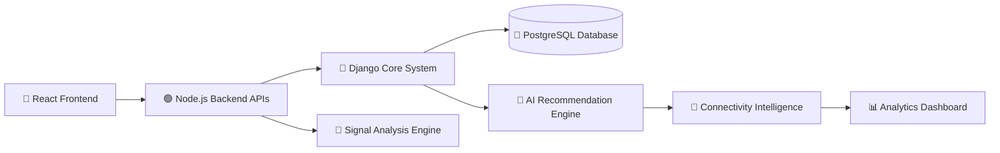

<div align="center">

# 📶 Zimo FirstAid


<br>


<br><br>


</div>

---

<div align="center">

## 🚀 Intelligent Connectivity • Adaptive Networks • AI-Powered Analysis

</div>

---

# 🧠 Introduction

Zimo FirstAid is a next-generation connectivity intelligence platform focused on improving internet reliability, carrier analysis, and adaptive network systems for modern mobile users.

The platform is designed to solve one of the most common digital problems faced by millions of users every day:

> Weak internet connectivity.

Whether users are traveling, studying online, gaming, working remotely, or navigating rural areas, unstable internet access creates frustration and productivity loss.

Zimo FirstAid aims to provide a smarter connectivity experience through:

- 📶 Real-time signal analysis
- ⚡ Internet performance testing
- 🧠 AI-powered network recommendations
- 📍 Location-based connectivity intelligence
- 🔄 Future adaptive eSIM technologies

The long-term vision is to build a platform where internet connectivity automatically adapts to user environments and provides the strongest possible network experience.

---

# 🌍 Real World Problem

In many regions, users experience:

```text
• Weak mobile signal
• Slow internet speeds
• Frequent network drops
• Inconsistent carrier performance
• Poor coverage while traveling
• Difficulty identifying better networks
```

Most users currently solve this problem manually by:
- changing SIM cards
- switching carriers
- purchasing multiple plans
- testing networks individually

This process is inefficient, expensive, and inconvenient.

Zimo FirstAid is being developed to simplify connectivity decisions using intelligent network analysis systems.

---

# 🎯 Mission

> Build an intelligent connectivity ecosystem that helps users automatically discover and optimize the best available internet connection.

---

# 💡 Vision

The future vision of Zimo FirstAid is to create:

```text
✔ Smart adaptive connectivity
✔ AI-powered internet optimization
✔ Intelligent carrier analysis
✔ Dynamic network recommendations
✔ eSIM-based switching systems
✔ Connectivity intelligence infrastructure
✔ Reliable internet accessibility for everyone
```

---

# ⚡ Core Features

<div align="center">

| Feature | Description |
|---|---|
| 📶 Signal Analysis | Analyze mobile signal strength in real time |
| ⚡ Speed Testing | Measure upload, download, and latency |
| 🧠 Smart Recommendations | Suggest stronger nearby networks |
| 📍 Location Intelligence | Detect weak coverage areas |
| 📊 Connectivity Dashboard | Visualize network analytics |
| 🔄 Future eSIM Systems | Adaptive internet switching |
| 🌙 Modern Interface | Responsive and clean user experience |
| 📡 Carrier Comparison | Compare available network quality |

</div>

---

# 🏗️ System Architecture

<div align="center">



</div>

---

# 💻 Technology Stack

---

## ⚛ Frontend — React.js

The frontend layer focuses on building a modern and responsive user experience.

### Features

```text
✔ Dynamic UI Components
✔ Responsive Layouts
✔ Real-Time Connectivity Data
✔ Interactive Dashboards
✔ Fast User Experience
✔ Modern Interface Design
```

---

## 🟢 Backend — Node.js

The backend system manages APIs, connectivity processing, and communication between services.

### Features

```text
✔ REST API Architecture
✔ Authentication Systems
✔ Connectivity Processing
✔ Analytics Services
✔ Scalable API Design
✔ Performance Optimization
```

---

## 🐍 Core Framework — Django

Django serves as the central management and intelligence layer of the platform.

### Features

```text
✔ Core Application Management
✔ AI Integration Layer
✔ Security Systems
✔ Admin Management
✔ Scalable Architecture
✔ Data Orchestration
```

---

## 🐘 Database — PostgreSQL

PostgreSQL stores analytics, connectivity insights, user data, and system reports.

### Features

```text
✔ High Performance Queries
✔ Reliable Relational Storage
✔ Scalable Data Management
✔ Connectivity Analytics Storage
✔ Structured System Architecture
```

---

# 📂 Project Structure

```bash
zimofirstaid/
│
├── frontend/
│   ├── public/
│   ├── src/
│   │   ├── components/
│   │   ├── pages/
│   │   ├── services/
│   │   ├── context/
│   │   ├── hooks/
│   │   ├── layouts/
│   │   └── App.js
│   │
│   └── package.json
│
├── backend/
│   ├── routes/
│   ├── middleware/
│   ├── controllers/
│   ├── services/
│   ├── models/
│   ├── utils/
│   └── server.js
│
├── django-core/
│   ├── apps/
│   ├── api/
│   ├── settings/
│   ├── intelligence/
│   ├── analytics/
│   ├── manage.py
│   └── requirements.txt
│
├── docs/
├── assets/
├── README.md
├── roadmap.md
└── LICENSE
```

---

# 🧠 Connectivity Intelligence Engine

The intelligence engine is one of the core concepts behind Zimo FirstAid.

It is designed to analyze:

```text
• Signal strength
• Internet speed
• Carrier reliability
• Geographic performance
• User movement patterns
• Connectivity stability
```

The goal is to generate smarter connectivity recommendations for users automatically.

---

# 📊 Analytics System

The analytics dashboard will help users understand their internet quality using:

```text
✔ Speed analytics
✔ Signal monitoring
✔ Carrier comparison
✔ Weak-zone reports
✔ Connectivity trends
✔ Performance scoring
```

---

# 🚀 Development Roadmap

## 🟢 Phase 1 — MVP

### Goals

```text
✔ Signal strength detector
✔ Speed testing engine
✔ Connectivity dashboard
✔ Carrier comparison
✔ Basic analytics system
✔ Responsive frontend
```

---

## 🟡 Phase 2 — Intelligence Layer

### Goals

```text
✔ AI-powered recommendations
✔ Connectivity scoring
✔ Location intelligence
✔ Smart network analysis
✔ Dead-zone detection
✔ User connectivity insights
```

---

## 🔴 Phase 3 — Adaptive Connectivity

### Goals

```text
✔ eSIM support
✔ Dynamic switching systems
✔ Emergency internet mode
✔ Telecom integrations
✔ Connectivity subscriptions
✔ Adaptive internet architecture
```

---

# ⚙️ Installation Guide

---

## 1️⃣ Clone Repository

```bash
git clone https://github.com/mav8stro/zimofirstaid.git
```

---

## 2️⃣ Navigate Into Project

```bash
cd zimofirstaid
```

---

# ⚛ Frontend Setup

```bash
cd frontend

npm install

npm start
```

---

# 🟢 Backend Setup

```bash
cd backend

npm install

node server.js
```

---

# 🐍 Django Core Setup

```bash
cd django-core

python -m venv venv

venv\Scripts\activate

pip install -r requirements.txt

python manage.py runserver
```

---

# 🌍 Target Users

```text
✔ Students
✔ Travelers
✔ Remote workers
✔ Rural communities
✔ Mobile gamers
✔ Delivery agents
✔ Business users
✔ Everyday smartphone users
```

---

# 🔥 Why Zimo FirstAid?

Most internet platforms focus only on providing connectivity.

Zimo FirstAid focuses on:
> improving connectivity intelligence.

The platform aims to help users make smarter decisions about internet access instead of struggling with weak network conditions blindly.

---

# 💡 Future Possibilities

```text
🚀 AI-powered connectivity optimization
🚀 Global connectivity intelligence
🚀 Adaptive mobile internet systems
🚀 Telecom integrations
🚀 Smart travel internet packs
🚀 Connectivity heatmaps
🚀 Intelligent eSIM ecosystems
🚀 Connectivity-as-a-Service
```

---

# 📈 GitHub Analytics

<div align="center">


</div>

---

# 🔥 Contribution Graph

<div align="center">


</div>

---

# 👨‍💻 Developer

<div align="center">

## Muhammed Salman N

Full Stack Developer

⚛ React.js  
🟢 Node.js  
🐍 Django  
🐘 PostgreSQL

### Interests

```text
• Full Stack Development
• AI Systems
• Connectivity Intelligence
• Startup Building
• Mobile Technologies
• Scalable Architectures
```

<a href="https://github.com/mav8stro">
  
</a>

</div>

---

# 📄 License

```text
MIT License
```

---

<div align="center">


</div>
